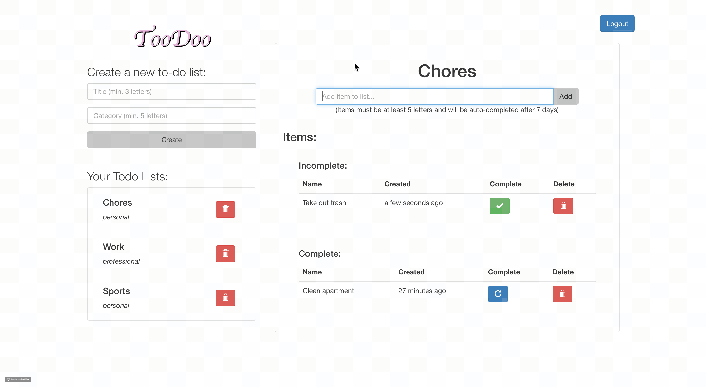

# Toodoo
## A self-destructing to-do list to make your life less cluttered.

**Note**: This is the React front-end application; for the actual API, please view [this](https://github.com/bmorr123/toodoo) repository.

This repository holds a todo list application built with React. You can go to [this](https://my-toodoo.herokuapp.com/) URL to sign up and start using it! This app consumes a Rails 5 API that I made in order to save, display, and edit todo lists.

### Prerequisites

If you want to remotely access the API that this todo list interacts with, you must send requests from `localhost:8080` (this app is set up to do so)

### Getting Started

If you would like to use this project remotely to add additional functionality to the app itself, you can perform the following steps:

1. Clone this repository
2. `cd` into the `toodoo-react` directory and run `npm install`
3. Edit the code (if you'd like)
4. Run `npm start` within your terminal
5. Visit `localhost:8080` in your browser to start using!

### Components in the App

The following components & containers make up this application:

| **Component** | **Description** |
| :--- | :--- |
| `Authentication` | Holds the `Login` and `Signup` components to control user authentication. |
| `Login` | Responsible for verifying user login credentials. |
| `Signup` | Responsible for creating new users. |
| `Home` | The main container that holds all components/containers of the main app page. |
| `TodoListGroup` | Renders the list of todo lists the user has created, with the ability to remove individual lists. |
| `NewTodoList` | A form component that creates new todo lists |
| `ActiveTodo` | Responsible for displaying the currently-selected todo list. |
| `TodoItems` | Separates complete and incomplete items within the `TodoItemTable`. |
| `TodoItemTable` | A component that is part of the `ActiveTodo` component that is responsible for displaying the todo list items. |
